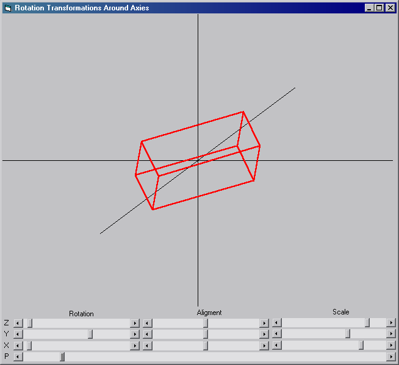



## Ultimate 3D Cube rotation \(With 3d rotation manual\)

### Description

Small code (100lines) illustrating how any 3d shape is rotated around the 3 axes.

Also teaches how you can draw a 3d object in VB's 2d form.

Included Manual describing the rotation and presentation methods

Also 3 Functions that will make rotating points easier
 
### More Info
 

             |
---                |---
**Submitted On**   |2004-06-05 13:58:02
**By**             |[Lefteris Eleftheriades](https://github.com/Planet-Source-Code/PSCIndex/blob/master/ByAuthor/lefteris-eleftheriades.md)
**Level**          |Beginner
**User Rating**    |4.2 (42 globes from 10 users)
**Compatibility**  |VB 6\.0
**Category**       |[Graphics](https://github.com/Planet-Source-Code/PSCIndex/blob/master/ByCategory/graphics__1-46.md)
**World**          |[Visual Basic](https://github.com/Planet-Source-Code/PSCIndex/blob/master/ByWorld/visual-basic.md)
**Archive File**   |[Ultimate\_3175417652004\.zip](https://github.com/Planet-Source-Code/lefteris-eleftheriades-ultimate-3d-cube-rotation-with-3d-rotation-manual__1-54201/archive/master.zip)

